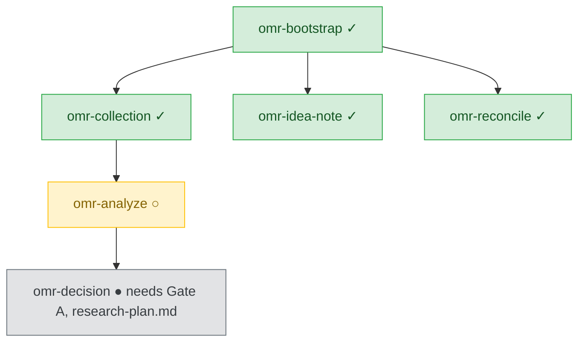

# Skill Tree: Progress Visualization

## Game-Inspired Model

Skills unlock progressively based on artifact prerequisites, similar to game skill trees.

**Default display** is Mermaid (renders in Markdown viewers). ASCII remains available via `--ascii`.

**Example state (Mermaid):**


**ASCII fallback** (`--ascii`):
```
omr-bootstrap ✓
    │
    ├── omr-collection ✓  (papers downloaded)
    │       │
    │       ├── omr-analyze ○  (ready to run)
    │       │       │
    │       │       └── omr-decision ●  (locked: needs Gate A pass + research-plan.md)
    │       │
    │       └── omr-idea-note ✓  (can run anytime)
    │
    └── omr-reconcile ✓  (can run anytime)
```

**Legend:**
- ✓ = complete (artifact produced)
- ○ = ready to run (prerequisites satisfied)
- ● = locked (missing prerequisites)

## Prerequisite System

Each skill has explicit prerequisites (from contracts):

| Skill | Prerequisites | Unlocks After Completion |
|-------|---------------|--------------------------|
| `omr-collection` | workspace | `omr-analyze` |
| `omr-analyze` | materials/ | `omr-decision` (after Gate A passes) |
| `omr-decision` | research-plan.md (Gate A passed) | `omr-evaluation` |
| `omr-evaluation` | architecture-decision.md | `omr-synthesis` |
| `omr-synthesis` | evaluation-report OR judgment | wiki (internal, `--no-wiki` to skip) |

## Always-Unlocked Skills

- `omr-idea-note` — Standalone, anytime
- `omr-reconcile` — Iteration + archive support, anytime

## Dual View Mode

### Forward View: "What can I do next?"
- Explore possibilities
- See unlocked skills
- Good for open-ended research

**Display:**
```
Available skills:
[✓] omr-analyze (ready)
[●] omr-decision (locked: needs Gate A pass)
[✓] omr-idea-note (anytime)
```

### Reverse View: "I want to produce X. What skills do I need?"
- Goal-driven planning
- Shortest path resolution
- Good for deadline research

**Example:**
```
Goal: Produce survey
Path: 
  1. omr-collection ✓
  2. omr-analyze ○
  3. omr-decision ●
  4. omr-evaluation ●
  5. omr-synthesis ●

Estimated: 4 skills between you and goal
Missing: 3 artifacts
```

## Skill Tree Updates

Skill tree updates automatically after each skill completion:
1. Mark skill as ✓ complete
2. Check downstream skills for unlock
3. Update any unlocked skills to ○
4. Display updated tree to user

## Toggle Between Views

User can toggle anytime:
- `/omr-tree --forward` → Show forward view
- `/omr-tree --reverse --goal survey` → Show reverse view for goal

## Pattern Integration

Patterns define skill tree paths:
- Evidence-First → Predefined unlock sequence
- Experiment-First → Different starting point, different unlock order
