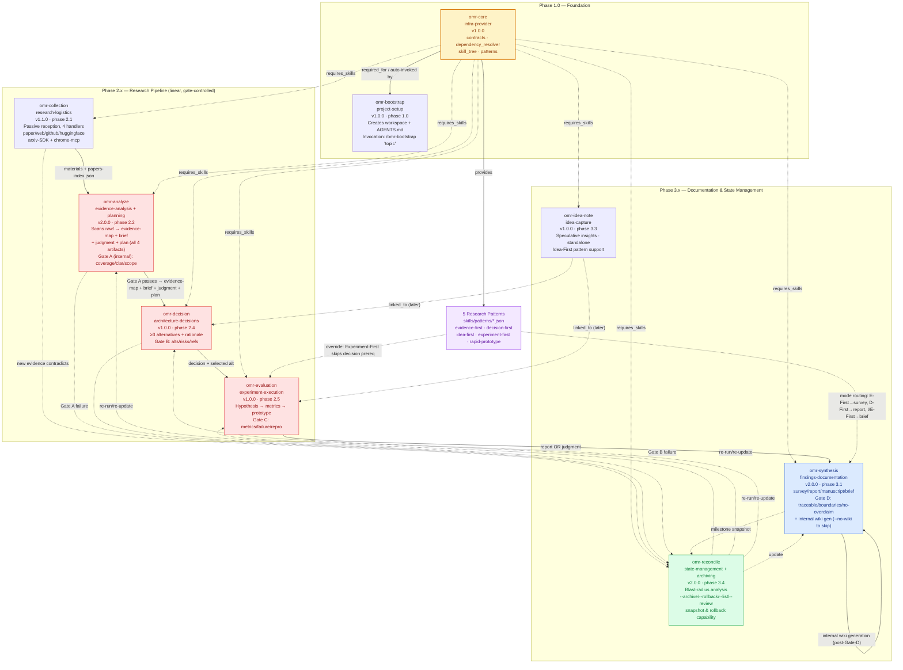

# OMR Skills Structure — Mermaid Flowchart

**Deliverable (Step BPD-01)**: Mermaid flowchart displaying analyzed OMR skills structures with supporting findings.

**Source**: Analyzed `skills/README.md` and all 9 `skills/omr-*/SKILL.md` specifications in the `omni-research` workspace.

---

## Mermaid Flowchart

---

## Supporting Findings

### 1. Skill Inventory (9 OMR skills + shared infra)

| Skill | Phase | Category | Version | Category Tag |
|---|---|---|---|---|
| omr-core | infra | infrastructure-provider | 1.0.0 | foundation |
| omr-bootstrap | 1.0 | project-setup | 1.0.0 | entry point |
| omr-collection | 2.1 | research-logistics | 1.1.0 | materials |
| omr-analyze | 2.2 | evidence-analysis + planning | 2.0.0 | evidence map + judgment + plan |
| omr-decision | 2.4 | architecture-decisions | 1.0.0 | ≥3 alternatives |
| omr-evaluation | 2.5 | experiment-execution | 1.0.0 | hypothesis→prototype |
| omr-synthesis | 3.1 | findings-documentation | 2.0.0 | writeback + wiki |
| omr-idea-note | 3.3 | idea-capture | 1.0.0 | speculative |
| omr-reconcile | 3.4 | state-management + archiving | 2.0.0 | blast radius + snapshots |

### 2. Lifecycle Architecture — Three Phases

- **Phase 1.0 (Foundation)**: `omr-core` provides the contract system, dependency resolver, skill-tree tracker, and pattern definitions. `omr-bootstrap` is the single entry point — it initializes the workspace (`raw/`, `docs/`, `src/`, `wiki/`) and generates `AGENTS.md`, auto-invoking `omr-core` infrastructure.
- **Phase 2.x (Research Pipeline)**: A strictly linear, gate-controlled chain — collection → analyze → decision → evaluation. `omr-analyze` produces all 4 artifacts (research-brief.md, evidence-map.md, judgment-summary.md, research-plan.md) and runs Gate A as an internal checkpoint (position: after_judgment_before_plan); it unlocks `omr-decision` once Gate A passes. Each stage consumes the prior stage's artifacts and emits a gate review (Gate B in decision, Gate C in evaluation).
- **Phase 3.x (Documentation & State)**: `omr-synthesis` (Gate D) writes authoritative findings in 4 configurable modes and performs internal wiki generation after Gate D (use `--no-wiki` to skip); `omr-idea-note` is a lightweight, dependency-free capture channel; `omr-reconcile` handles state management, blast-radius analysis, and archiving/rollback (via `--archive`, `--rollback`, `--list`, `--review` modes).

### 3. Dependency Model

- **Universal prerequisite**: Every skill declares `requires_skills: [omr-core]` and `requires_workspace: true` (except `omr-bootstrap`, which itself initializes the workspace).
- **Artifact-bound contracts**: 8 JSON contracts in `skills/shared/contracts/` define each skill's `requires`/`produces`/`gates`/`modes`. The dependency resolver (`skills/shared/dependency_resolver.py`) gates invocation by checking artifact presence, yielding `unlocked`/`ready`/`locked` states tracked in `tree/tree-state.json`.
- **Linear forward edges** (Phase 2): collection → analyze (`papers-index.json`; produces evidence-map + brief + judgment + plan) → decision (`evidence-{id}.md` required, `judgment-{id}.md` optional) → evaluation (`decision-{id}.md` required, with Experiment-First override).

### 4. Quality Gate System

| Gate | Owning Skill | Checks |
|---|---|---|
| Gate A | omr-analyze (internal checkpoint) | evidence coverage, question clarity, scope definition |
| Gate B | omr-decision | alternatives documented, risks stated, evidence refs valid |
| Gate C | omr-evaluation | metrics answer research question, failure conditions explicit, reproducible design |
| Gate D | omr-synthesis | results traceable, evidence boundaries stated, no over-claiming |

Gate failures feed back into `omr-reconcile`, enabling the system to loop rather than hard-fail.

### 5. Cross-Cutting Flows

- **Reconcile loops**: New contradicting evidence (from `omr-collection`) or Gate A/B failures trigger `omr-reconcile`, which computes blast radius, archives superseded artifacts (via its internal `--archive` mode), and re-runs/updates affected downstream skills (analyze, decision, evaluation, synthesis).
- **Idea-note anywhere**: `omr-idea-note` has no dependencies and is available at any point in the lifecycle; captured ideas may later be linked to decisions/experiments (supports the Idea-First research pattern).
- **Archive triggers**: manual snapshots (`--archive`), automatic during reconcile (superseded versions), pre-Gate-D safety, and post-synthesis milestone preservation — all handled internally by `omr-reconcile`.

### 6. Pattern System (Flow Control Overlay)

Five research patterns in `skills/patterns/*.json` override default control flow without changing skill structure:
- **evidence-first** → default synthesis mode `survey` (comprehensive)
- **decision-first** → synthesis mode `report` (structured)
- **idea-first** → synthesis mode `brief` (quick)
- **experiment-first** → allows `omr-evaluation` without a prior `decision-{id}.md`; synthesis mode `brief`
- **rapid-prototype** → (fast-iteration variant)

Patterns are provided by `omr-core` and detected at runtime by `skills/shared/detect_pattern.py`, routing output modes in `omr-synthesis` and relaxing prerequisites in `omr-evaluation`.

### 7. Notable Design Observations

- `omr-collection` is explicitly scoped as **logistics, not research** — "Passive Reception" philosophy enforces minimal parsing (format access + metadata only); semantic extraction is deferred to `omr-analyze` (boundary: "Collection = preparation, Analyze = evidence + judgment + plan").
- `omr-analyze` enforces a non-negotiable evidence-boundary rule: author statements classified as `proven`/`suggests`/`inferred`/`speculative`, with speculative claims excluded from the evidence map. This boundary propagates through to `omr-synthesis` (Gate D: "no over-claiming").
- `omr-decision` requires **at least 3 alternatives** (baseline, evidence-suggested, novel, optionally hybrid), each with evidence basis, pros/cons, and risks — enforcing traceable, reversible architectural choices.
- All skill outputs are artifact-bound (files under `docs/plans/`, `docs/survey/`, etc.), enabling the dependency resolver and archive snapshotting to operate uniformly.
