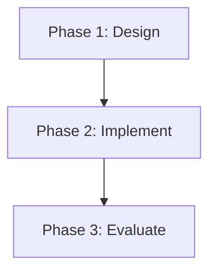

# omr-analyze: Map Evidence and Plan Research

## Purpose

Transform raw materials into a structured research brief, evidence map, judgment summary, and actionable research plan — all within a single skill. This skill bridges the gap between material collection and decision-making by enforcing strict evidence boundaries (proven/suggests/inferred/speculative) and presenting Gate A as an internal checkpoint before execution planning.

**Merged from:** `omr-evidence` (v1.0.0) + `omr-research-plan` (v1.0.0). Gate A, previously a boundary between two skills, becomes an internal review checkpoint.

## Trigger

```
/omr-analyze
```

**No arguments required** — operates on materials in `raw/` directory

**Automatic trigger conditions:**
- After `omr-collection` completes with ≥1 paper
- User explicitly requests evidence analysis or research planning
- User asks "now what" or "analyze these papers"

## What This Skill Does

This skill has four internal phases executed sequentially:

### Phase 1: Scan Raw Materials

**Required prerequisite:**
- At least 1 material in `raw/` directory
- `docs/index/papers-index.json` must exist

**Scan process:**
1. Read `docs/index/papers-index.json` for paper list
2. Read `docs/index/blogs-index.json` for blog list
3. Read `docs/index/github-index.json` for GitHub repos
4. Count materials per tier

**If no materials found:**
- Error: "No materials in `raw/`. Run `/omr-collection` first."
- Do not proceed

### Phase 2: Extract Findings and Generate Evidence Artifacts

For each paper in `raw/paper/`:
1. Read abstract (from index metadata)
2. If abstract missing, attempt to extract from PDF (using text parsing)
3. Identify key contributions stated by authors
4. Note methodology (theoretical, empirical, survey)
5. Extract limitations acknowledged by authors
6. Map to evidence strength:
   - "We prove X" → `proven`
   - "We demonstrate X" → `suggests`
   - "We hypothesize X" → `inferred`
   - "X may be" → `speculative` (exclude from evidence)

**Evidence strength classification:**

| Author Statement | Evidence Boundary | Usage in Research |
|------------------|-------------------|-------------------|
| "We prove X" | proven | Can anchor claims |
| "We demonstrate/show X" | suggests | Supporting evidence |
| "We hypothesize/propose X" | inferred | Lead for further investigation |
| "X may be/could be" | speculative | Exclude from evidence map |

**Non-negotiable rule:**
Never claim "paper proves X" when authors only "suggest" or "demonstrate".

**Question derivation algorithm:**
1. Collect all paper titles
2. Extract keywords from abstracts
3. Identify common themes:
   - Count keyword frequency
   - Group related concepts
   - Select top 3 themes
4. Formulate question:
   - If single dominant theme: "How does {theme} work?"
   - If multiple themes: "What are the {theme1}, {theme2}, and {theme3} mechanisms?"
5. Ask user confirmation:
   - Display detected question
   - Options: [Accept] [Edit] [Reject and provide own]

**Generate research brief** — Create `docs/plans/brief-{id}.md`:

**Metadata:**
```yaml
---
id: Q-001
type: research-brief
version: 1.0.0
question: "How do AI agents maintain long-term memory?"
scope: "Lifecycle mechanisms for agent memory"
non_goals: ["Retrieval optimization only", "Short-term memory (< 1 day)"]
success_criteria:
  - "Identify formation patterns"
  - "Map evolution strategies"
  - "Compare retrieval mechanisms"
created_at: 2026-04-11T11:30:00Z
updated_at: 2026-04-11T11:30:00Z
status: draft
dependencies: [COL-001]
---
```

**Content structure:**
```markdown
# Research Brief: {question}

## Research Question

{Primary question derived from material themes}

## Scope

**Included:**
- {Scope definition}

**Excluded (Non-goals):**
- {Non-goals to prevent scope creep}

## Success Criteria

- [ ] {Criterion 1}
- [ ] {Criterion 2}
- [ ] {Criterion 3}

## Material Coverage

- Papers analyzed: {N}
- Blogs analyzed: {M}
- GitHub repos: {K}

## Evidence Sources

Primary evidence: {N papers}
Supporting evidence: {M blogs}
Implementation references: {K repos}

## Next Steps

Proceed to evidence map generation and judgment synthesis.
```

**Generate evidence map** — Create `docs/plans/evidence-{id}.md`:

**Metadata:**
```yaml
---
id: Q-001
type: evidence-map
version: 1.0.0
question_id: Q-001
primary_evidence: [P-001, P-002, P-003]
supporting_evidence: [B-001, B-002]
open_gaps:
  - "No longitudinal studies on memory evolution"
  - "Evaluation methodology lacks standardization"
  - "Formation mechanisms underexplored"
papers_analyzed: 10
blogs_analyzed: 3
github_analyzed: 2
created_at: 2026-04-11T11:30:00Z
updated_at: 2026-04-11T11:30:00Z
status: draft
dependencies: [COL-001]
---
```

**Content structure:**
```markdown
# Evidence Map: {question}

## Primary Evidence (Tier 1)

### P-001: Memory Systems for AI Agents
- **Finding:** Hybrid vector-graph memory improves retrieval accuracy
- **Evidence:** proven (validated with benchmarks)
- **Limitations:** Evaluated on short-term tasks only (max 7 days)
- **Relevance:** Directly addresses formation mechanisms

### P-002: Long-term Memory in Agents
- **Finding:** Memory lifecycle comprises formation, evolution, retrieval
- **Evidence:** suggests (empirical demonstration on simulated tasks)
- **Limitations:** No real-world validation
- **Relevance:** Defines lifecycle framework

### P-003: Memory Formation Patterns
- **Finding:** Importance threshold determines memory persistence
- **Evidence:** proven (mathematical derivation)
- **Relevance:** Formalizes formation criteria

## Supporting Evidence (Tier 2)

### B-001: Production Memory Systems
- **Finding:** Engineering implementations use vector databases
- **Evidence:** suggests (case studies from industry)
- **Relevance:** Practical validation of hybrid approaches

### B-002: Memory Evolution in Practice
- **Finding:** Manual pruning required to prevent memory bloat
- **Evidence:** inferred (blog proposes, no validation)
- **Relevance:** Highlights evolution challenges

## Implementation References (Tier 4)

### GH-001: Agent Memory Framework
- **Type:** Reference implementation
- **Approach:** Vector-only memory
- **Relevance:** Baseline for comparison

## Open Gaps

1. **No longitudinal studies:** Memory evolution over weeks/months unexplored
2. **Evaluation methodology unclear:** No standardized benchmarks for lifecycle
3. **Formation mechanisms underexplored:** Theory exists, practical implementation lacking

## Evidence Boundaries

**Proven:**
- Hybrid memory improves retrieval (P-001)
- Importance threshold determines persistence (P-003)

**Suggested:**
- Lifecycle comprises formation, evolution, retrieval (P-002)
- Vector databases used in production (B-001)

**Inferred:**
- Manual pruning needed (B-002, blog proposes)

**Not Evidence:**
- Speculative claims excluded from map

## Coverage Analysis

- Papers: 10 analyzed, 3 primary evidence
- Blogs: 3 analyzed, 2 supporting
- GitHub: 2 reference implementations

**Coverage assessment:** Moderate — key mechanisms identified, but gaps in longitudinal validation and evaluation methodology.
```

**Evidence boundary detection — language cues:**

| Phrase | Boundary | Example |
|--------|----------|---------|
| "we prove", "proof of", "theorem" | proven | "We prove that X reduces latency by 15%" |
| "we demonstrate", "we show", "results indicate" | suggests | "We demonstrate improved accuracy" |
| "we propose", "we hypothesize", "we conjecture" | inferred | "We propose a new mechanism" |
| "may", "could", "might", "possibly" | speculative | "This could improve performance" |
| "should", "would likely" | speculative | "This should reduce cost" |

**Boundary enforcement:**
- If paper claims "prove", classify as `proven`
- If paper claims "show/demonstrate", classify as `suggests`
- If paper claims "propose/hypothesize", classify as `inferred`
- If paper uses speculative language, **exclude from evidence map**

**Critical rule:**
Never upgrade evidence strength. If paper "suggests" X, never write "proven" in evidence map.

**Gap detection:**

Gap categories:
1. **Methodological gaps:** No longitudinal studies, missing benchmarks, evaluation unclear
2. **Evidence gaps:** Key mechanism unvalidated, contradictory findings, missing real-world validation
3. **Implementation gaps:** Theory exists practice missing, engineering challenges unaddressed, tooling insufficient

Gap identification process:
1. Read limitations sections of papers
2. Check for "future work" mentions
3. Compare claims vs. validation
4. Note contradictions between papers

**Cross-reference format:**
```markdown
### P-001: Memory Systems
- **Finding:** Hybrid memory improves retrieval
- **Evidence:** proven (benchmarks validated)
- **Links to:** P-002 (lifecycle framework), B-001 (production validation)
```

**Dependency tracking:**
- Note which papers cite each other
- Identify supporting papers (cite primary paper)
- Map evidence clusters (papers supporting same claim)

### Phase 3: Synthesize Judgment

**Judgment synthesis process:**

1. **Analyze primary evidence:**
   - What do proven findings collectively indicate?
   - Are findings consistent or contradictory?
   - Which mechanisms are well-supported?

2. **Assess evidence weight:**
   - Strong: Multiple proven findings supporting same claim
   - Medium: Mix of proven and suggests
   - Weak: Mostly suggests/inferred, few proven

3. **Identify contradictions:**
   - Do any papers contradict others?
   - Are there conflicting methodologies?
   - Note unresolved debates

4. **Formulate main conclusion:**
   - Summarize what evidence collectively shows
   - Identify key insight from evidence landscape
   - Highlight strongest supported claim

5. **Assign confidence:**
   - High: Strong evidence weight, no contradictions, clear gaps
   - Medium: Moderate evidence, minor contradictions, gaps manageable
   - Low: Weak evidence, major contradictions, many gaps

**Judgment summary metadata:**
```yaml
---
id: J-001
type: judgment-summary
version: 1.0.0
question_id: Q-001
main_conclusion: "Current research focuses on retrieval mechanisms, neglects lifecycle evolution"
confidence: medium
contradictions: []
evidence_weight: moderate
primary_evidence_strength:
  - P-001: strong (validated retrieval)
  - P-003: strong (formalized formation)
  - P-002: moderate (framework proposed)
supporting_evidence_strength:
  - B-001: moderate (production validation)
  - B-002: weak (inferred, unvalidated)
created_at: 2026-04-11T12:00:00Z
updated_at: 2026-04-11T12:00:00Z
status: draft
dependencies: [Q-001]
gate_a_passed: null
---
```

**Judgment summary content:**
```markdown
# Judgment Summary: {question}

## Main Conclusion

{Synthesized judgment from evidence}

**Evidence weight:** {strong/moderate/weak}

## Evidence Assessment

### Primary Evidence

**Proven findings:**
- P-001: Hybrid memory improves retrieval [strong]
- P-003: Importance threshold formalized [strong]

**Suggested findings:**
- P-002: Lifecycle framework defined [moderate]

### Supporting Evidence

- B-001: Production validation [moderate]
- B-002: Manual pruning needed [weak]

### Evidence Weight Assessment

**Overall weight:** Moderate
- Retrieval mechanisms well-supported (strong)
- Lifecycle framework proposed but not validated (moderate)
- Evolution mechanisms underexplored (weak)

## Contradictions

{List of contradictions found, or "None detected"}

## Confidence Assessment

**Confidence level:** {high/medium/low}

**Rationale:**
- {Why this confidence level}
- {Factors supporting confidence}
- {Factors reducing confidence}

## Key Insights

1. {Insight 1 from evidence synthesis}
2. {Insight 2}
3. {Insight 3}

## Open Questions

{Questions that remain unanswered despite evidence}

## Next Steps

Proceed to Gate A review before plan generation.
```

### Phase 4: Gate A Review and Research Plan Generation

**Gate A: Before Research Planning**

**Position:** Internal checkpoint — after judgment synthesis, before plan execution
**Purpose:** Ensure evidence sufficient for planning

**Gate A checks:**
- [ ] Evidence coverage adequate (≥3 primary evidence or explicit user approval)
- [ ] Research question clear (defined in brief, user confirmed)
- [ ] Scope defined (included/excluded scope in brief)
- [ ] Judgment confidence reasonable (medium or high, or user accepts low)

**Gate A review process:**

1. Display judgment summary + planned research approach
2. Show gate criteria checklist
3. Ask user confirmation:
   ```
   ⚠️  GATE A: Before Planning

   Review criteria:
   [✓] Evidence coverage adequate (10 papers, 3 primary)
   [✓] Research question clear (lifecycle mechanisms)
   [✓] Scope defined (formation, evolution, retrieval)
   [✓] Judgment confidence reasonable (medium)

   Evidence assessment: Moderate weight, manageable gaps

   Proceed with plan? [Y/n/modify]
   ```

4. If user approves:
   - Mark `gate_a_passed: true` in judgment + plan
   - Record timestamp and reviewer
   - Proceed to plan generation

5. If user rejects:
   - Ask: "What needs modification?"
   - Offer options: [Edit scope] [Add evidence] [Revise priorities]
   - Loop until approved or user cancels

**Gate failure handling:**
- If Gate A fails: "Evidence insufficient. Options: [Add materials] [Reduce scope] [Proceed anyway]"
- Do not unlock `omr-decision` until gate passed

**After Gate A passes, generate research plan:**

**Plan generation process:**

1. **Identify priorities:**
   - Priority 1: Address strongest evidence-backed mechanism
   - Priority 2: Address gaps limiting confidence
   - Priority 3: Validate or extend existing findings

2. **Estimate timeline:**
   - Based on evidence complexity
   - Account for prototype + evaluation phases
   - Buffer for unexpected challenges

3. **Allocate resources:**
   - Number of parallel tracks
   - Required expertise (implementation, evaluation)
   - External dependencies (datasets, tools)

4. **Define execution steps:**
   - Sequential phases with dependencies
   - Deliverables per phase
   - Gate checkpoints

**Research plan metadata:**
```yaml
---
id: PLAN-001
type: research-plan
version: 1.0.0
question_id: Q-001
judgment_id: J-001
priorities:
  - priority: 1
    description: "Design and validate memory lifecycle model"
    rationale: "Addresses primary gap in current research"
    evidence_refs: [P-002, J-001]
  - priority: 2
    description: "Implement formation + evolution mechanisms"
    rationale: "Extends proven formation threshold to evolution"
    evidence_refs: [P-001, P-003]
  - priority: 3
    description: "Evaluate against benchmarks"
    rationale: "Standardize evaluation methodology"
    evidence_refs: [B-001]
timeline_estimated: "3-5 days"
timeline_breakdown:
  - phase: "Design"
    duration: "1 day"
    deliverables: ["Architecture decision"]
  - phase: "Implement"
    duration: "1-2 days"
    deliverables: ["Prototype code"]
  - phase: "Evaluate"
    duration: "1-2 days"
    deliverables: ["Evaluation report"]
resource_allocation:
  parallel_tracks: 2
  required_expertise: ["implementation", "evaluation"]
  external_dependencies: ["benchmark datasets"]
created_at: 2026-04-11T12:00:00Z
updated_at: 2026-04-11T12:00:00Z
status: draft
dependencies: [J-001]
gate_a_passed: null
---
```

**Research plan content:**
```markdown
# Research Plan: {question}

## Priorities

### Priority 1: {Description}
**Rationale:** {Why this priority}
**Evidence basis:** {Which evidence supports this}
**Deliverable:** {Expected output}

### Priority 2: {Description}
...

### Priority 3: {Description}
...

## Timeline

**Estimated duration:** {N-M days}

### Phase 1: Design (1 day)
- Deliverable: Architecture decision
- Gate: Gate B (decision review)

### Phase 2: Implementation (1-2 days)
- Deliverable: Prototype code in `src/prototype/`
- Dependencies: Phase 1 complete

### Phase 3: Evaluation (1-2 days)
- Deliverable: Evaluation report
- Dependencies: Phase 2 complete
- Gate: Gate C (experiment review)

## Resource Allocation

**Parallel tracks:** {N} (e.g., implementation + evaluation prep)

**Required expertise:**
- {Skill 1}
- {Skill 2}

**External dependencies:**
- {Dataset/tool required}

## Execution Strategy

**Approach:** {Sequential or parallel}

**Phase dependencies:**


## Success Metrics

- [ ] {Metric 1 aligned with research brief success criteria}
- [ ] {Metric 2}
- [ ] {Metric 3}

## Risk Factors

- {Risk 1}
- {Risk 2}

## Next Steps

Proceed to `/omr-decision` to make architecture decision.
```

### Phase 5: Update Skill Tree

After Gate A passed and plan generated:
- Mark `omr-analyze` as complete ✓
- Unlock `omr-decision` as ready ○

### Display Summary

```
Research Question: "How do AI agents maintain long-term memory?"
Scope: Lifecycle mechanisms (formation, evolution, retrieval)

Primary Evidence:
- P-001: Vector + graph fusion improves retrieval [proven]
- P-002: Memory lifecycle framework defined [suggests]
- P-003: Importance threshold formalized [proven]

Open Gaps:
- No longitudinal studies on memory evolution
- Evaluation methodology lacks standardization

Judgment: "Retrieval well-studied, lifecycle neglected" (medium confidence)
Plan: Design lifecycle model (Priority 1), 3-5 days

⚠️  GATE A: Before Planning
[✓] Evidence coverage adequate
[✓] Research question clear
[✓] Scope defined
[✓] Judgment confidence reasonable

✓ Gate A passed
✓ Generated: brief-Q-001.md, evidence-Q-001.md, judgment-J-001.md, plan-PLAN-001.md
📊 Skill tree: omr-decision [READY]

Next step: `/omr-decision` to make architecture decision
```

## Gates

**Gate A: Evidence sufficient for planning?**

**Position:** Internal checkpoint — after judgment synthesis, before plan generation
**Checks:**
1. Evidence coverage adequate (≥3 primary evidence or explicit user approval)
2. Research question clear (defined in brief, user confirmed)
3. Scope defined (included/excluded scope in brief)
4. Judgment confidence reasonable (medium or high, or user accepts low)

**Enforcement:**
- User confirmation required (default mode)
- Auto-pass if explicitly configured for agents

**Gate failure handling:**
- If Gate A fails: "Evidence insufficient. Options: [Add materials] [Reduce scope] [Proceed anyway]"
- Do not unlock `omr-decision` until gate passed

## Can Call

None

## Prerequisites

- Materials in `raw/` directory (required)
- `docs/index/papers-index.json` must exist
- If empty: Error "Run `/omr-collection` first."

## Examples

### Example 1: Full analysis with Gate A passed
```
User: /omr-analyze

System: ✓ Scanning materials...
        Papers: 10, Blogs: 3, GitHub: 2

        ✓ Extracting key findings...

        Detected research question:
        "How do AI agents maintain long-term memory?"

        Accept? [Y/n/edit]

User: Y

System: ✓ Research brief generated: brief-Q-001.md
        ✓ Evidence map generated: evidence-Q-001.md

        ✓ Synthesizing judgment...

        Judgment: "Retrieval well-studied, lifecycle neglected"
        Confidence: medium
        Evidence weight: moderate (3 proven, 2 suggests)

        Plan:
        1. Design lifecycle model (Priority 1)
        2. Implement formation + evolution (Priority 2)
        3. Evaluate benchmarks (Priority 3)
        Timeline: 3-5 days

        ⚠️  GATE A: Before Planning
        Criteria:
        [✓] Evidence coverage adequate
        [✓] Research question clear
        [✓] Scope defined
        [✓] Judgment confidence reasonable

        Proceed? [Y/n]

User: Y

System: ✓ Gate A passed
        ✓ Generated: brief-Q-001.md, evidence-Q-001.md,
                    judgment-J-001.md, plan-PLAN-001.md
        📊 Skill tree: omr-decision [READY]
```

### Example 2: Gate A failed (insufficient evidence)
```
User: /omr-analyze

System: ✓ Reading evidence...

        Judgment: "Limited evidence for lifecycle mechanisms"
        Confidence: low
        Evidence weight: weak (1 proven, 1 suggests)

        ⚠️  GATE A: Before Planning
        Criteria:
        [✗] Evidence coverage adequate (only 2 primary evidence)
        [✓] Research question clear
        [✓] Scope defined
        [⚠️] Judgment confidence reasonable (low)

        Gate A failed: Insufficient evidence coverage

        Options:
        [1] Add more materials via `/omr-collection`
        [2] Reduce scope to match evidence
        [3] Proceed anyway (low confidence accepted)

User: 1

System: Aborting plan. Run `/omr-collection` to add more papers.
```

### Example 3: Gate A modification requested
```
User: /omr-analyze

System: Plan:
        1. Design lifecycle model
        2. Implement formation
        3. Evaluate benchmarks

        Proceed? [Y/n/modify]

User: modify

System: What needs modification?
        [1] Priorities
        [2] Timeline
        [3] Scope
        [4] All of above

User: 1

System: Current priorities:
        1. Design lifecycle model
        2. Implement formation
        3. Evaluate benchmarks

        Edit Priority 1 description:

User: Validate existing lifecycle frameworks first

System: ✓ Priority 1 updated
        ✓ Plan revised

        Updated plan:
        1. Validate existing lifecycle frameworks
        2. Implement formation
        3. Evaluate benchmarks

        Proceed? [Y/n/modify]
```

### Example 4: Contradictions detected
```
User: /omr-analyze

System: ✓ Synthesizing judgment...

        ⚠️  Contradiction detected:
        P-001 claims "Hybrid memory superior"
        P-005 claims "Graph-only outperforms hybrid"

        Evidence conflict: Comparative study needed

        Judgment: "Hybrid vs. graph-only debated"
        Confidence: medium (contradictions present)

        Plan:
        1. Comparative study of hybrid vs. graph-only
        2. Implement both for benchmarking
        3. Evaluate performance trade-offs

        ⚠️  GATE A: Before Planning
        [✓] Evidence coverage adequate
        [✓] Question clear
        [✓] Scope defined
        [⚠️] Contradictions present (addressed in plan)

        Proceed? [Y/n]
```

### Example 5: Insufficient evidence
```
User: /omr-analyze

System: ⚠️  No materials found in `raw/`
        Cannot proceed without evidence sources.

        Run `/omr-collection` first to add papers, blogs, or other materials.

        Aborting...
```

### Example 6: Evidence boundary warning
```
User: /omr-analyze

System: ✓ Extracting findings from P-005...

        ⚠️  Evidence boundary violation detected:
        Paper P-005 claims "We show that X improves performance"
        Cannot be classified as "proven" — classified as "suggests"

        Never claim "paper proves X" when it only "shows" X.

        Evidence map updated with correct boundary: suggests
```

### Example 7: Gap-heavy evidence landscape
```
User: /omr-analyze

System: ✓ Evidence map generated

        ⚠️  Coverage assessment: Weak
        Open gaps: 5 critical, 3 moderate

        Critical gaps:
        - No empirical validation of core mechanism
        - Contradictory findings between P-001 and P-002
        - Missing standard evaluation methodology

        Recommendation: Add more materials via `/omr-collection` before proceeding to planning.

        Proceed anyway? [Y/n]
```

## What NOT to Do

- Do NOT claim papers "prove" findings when they only "suggest"
- Do NOT include speculative findings in evidence map
- Do NOT proceed without materials in `raw/`
- Do NOT auto-generate research question without user confirmation
- Do NOT skip gap detection (always analyze limitations)
- Do NOT claim complete coverage when gaps exist
- Do NOT use deep-research reports as primary evidence (Tier 3 only)
- Do NOT skip Gate A review (user must confirm)
- Do NOT unlock `omr-decision` if Gate A failed
- Do NOT claim high confidence when evidence weight is weak
- Do NOT ignore contradictions (must address in plan)
- Do NOT auto-generate plan without showing judgment first
- Do NOT proceed if confidence low without user acceptance

## Success Criteria

- [ ] Research brief created with clear question, scope, non-goals
- [ ] Evidence map created with primary + supporting evidence
- [ ] Evidence boundaries correctly assigned (proven/suggests/inferred)
- [ ] Open gaps identified and documented
- [ ] Cross-references between papers noted
- [ ] Judgment summary created with main conclusion + confidence
- [ ] Research plan created with priorities + timeline
- [ ] Evidence weight correctly assessed
- [ ] Contradictions identified and addressed
- [ ] Gate A review presented
- [ ] Gate A passed (user approved)
- [ ] `gate_a_passed: true` recorded in metadata
- [ ] Skill tree updated (unlock `omr-decision`)
- [ ] User confirmed research question
- [ ] Coverage assessment provided

## Edge Cases

### Single paper

If only 1 paper:
- Generate brief with narrow scope
- Evidence map: 1 primary evidence
- Note: "Coverage limited — add more materials recommended"
- Still proceed (Gate A will catch insufficient evidence)

### Contradictory evidence

If papers contradict:
- Note in evidence map: "Contradiction detected"
- Evidence: P-001 claims X, P-002 claims ¬X
- Gap: "Resolution needed — comparative study required"
- Do not resolve contradiction (that's `omr-decision`'s job)

### Missing abstracts

If paper lacks abstract:
- Attempt PDF text extraction
- If fails: Use title as placeholder
- Note in evidence map: "Abstract missing — manual review needed"
- Ask user: "Paper {ID} lacks abstract. Provide summary? [y/N]"

### Deep-research reports

If deep-research reports present (Tier 3):
- Include in evidence map with clear label: "lead-only"
- Note: "Not anchor evidence — use as exploration leads only"
- Do not classify as primary or supporting evidence

### Non-English papers

If papers not in English:
- Note in evidence map: "Non-English content"
- Use abstract if provided in English
- Otherwise: "Requires translation — manual review needed"

### Low confidence

If confidence is low:
- Warn user in Gate A: "Confidence: low (weak evidence, many gaps)"
- Offer options: [Add evidence] [Reduce scope] [Proceed anyway]
- If user accepts low confidence, proceed

### Major contradictions

If major contradictions detected:
- Note in judgment: "Contradictions present, resolution needed"
- Adjust plan: Priority 1 should address contradiction
- Gate A: Mark contradiction check as ⚠️
- Require user confirmation: "Proceed with contradictions unresolved? [Y/n]"

### Empty evidence landscape

If no primary evidence:
- Judgment confidence: low
- Evidence weight: weak
- Gate A: Fail automatically
- Message: "No primary evidence found. Run `/omr-collection` to add peer-reviewed papers."

### Single priority plan

If evidence supports only one priority:
- Plan: Single priority with detailed execution
- Timeline: Estimated for single priority
- Gate A: Note "Single priority plan — limited scope"
- Proceed if user accepts

### Overly ambitious timeline

If estimated timeline > 7 days:
- Warn user: "Timeline exceeds 7 days — consider reducing scope"
- Offer: [Reduce priorities] [Extend timeline] [Proceed anyway]

## Integration with Other Skills

**After analysis:**
- Unlock `omr-decision` for architecture decision
- Prepare for Gate B review

**Before analysis:**
- Requires `omr-collection` for materials

**Reconciliation:**
- If new materials added later, `omr-reconcile` may call this skill to update evidence map and re-plan

**Pattern flexibility:**
- Evidence-First: Gate A required (default path through all 4 phases)
- Idea-First: Gate A skipped (no prior evidence, early-exit before Phase 1)
- Experiment-First: Gate A may be relaxed
