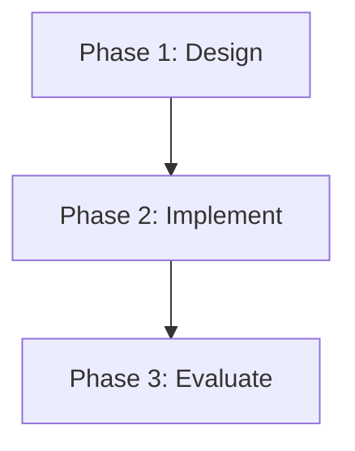

# omr-research-plan: Judge Evidence and Plan Research

## Purpose

Synthesize judgment from collected evidence and create a actionable research plan. This skill transforms the evidence landscape into a clear judgment summary with confidence assessment, and a prioritized execution plan with timeline and resource allocation.

## Trigger

```
/omr-research-plan
```

**No arguments required** — operates on evidence-map and research-brief

**Prerequisites:**
- `docs/plans/evidence-{id}.md` must exist
- `docs/plans/brief-{id}.md` must exist

## What This Skill Does

### 1. Read Evidence Map and Research Brief

**Required artifacts:**
- Evidence map: `docs/plans/evidence-{id}.md`
- Research brief: `docs/plans/brief-{id}.md`

**If missing:**
- Error: "Missing evidence map. Run `/omr-evidence` first."
- Do not proceed

**Load data:**
- Research question
- Scope and non-goals
- Primary evidence list
- Supporting evidence list
- Open gaps

### 2. Synthesize Judgment

**Judgment synthesis process:**

1. **Analyze primary evidence:**
   - What do proven findings collectively indicate?
   - Are findings consistent or contradictory?
   - Which mechanisms are well-supported?

2. **Assess evidence weight:**
   - Strong: Multiple proven findings supporting same claim
   - Medium: Mix of proven and suggests
   - Weak: Mostly suggests/inferred, few proven

3. **Identify contradictions:**
   - Do any papers contradict others?
   - Are there conflicting methodologies?
   - Note unresolved debates

4. **Formulate main conclusion:**
   - Summarize what evidence collectively shows
   - Identify key insight from evidence landscape
   - Highlight strongest supported claim

5. **Assign confidence:**
   - High: Strong evidence weight, no contradictions, clear gaps
   - Medium: Moderate evidence, minor contradictions, gaps manageable
   - Low: Weak evidence, major contradictions, many gaps

**Judgment summary metadata:**
```yaml
---
id: J-001
type: judgment-summary
version: 1.0.0
question_id: Q-001
main_conclusion: "Current research focuses on retrieval mechanisms, neglects lifecycle evolution"
confidence: medium
contradictions: []
evidence_weight: moderate
primary_evidence_strength:
  - P-001: strong (validated retrieval)
  - P-003: strong (formalized formation)
  - P-002: moderate (framework proposed)
supporting_evidence_strength:
  - B-001: moderate (production validation)
  - B-002: weak (inferred, unvalidated)
created_at: 2026-04-11T12:00:00Z
updated_at: 2026-04-11T12:00:00Z
status: draft
dependencies: [Q-001]
gate_a_passed: null
---
```

**Judgment summary content:**
```markdown
# Judgment Summary: {question}

## Main Conclusion

{Synthesized judgment from evidence}

**Evidence weight:** {strong/moderate/weak}

## Evidence Assessment

### Primary Evidence

**Proven findings:**
- P-001: Hybrid memory improves retrieval [strong]
- P-003: Importance threshold formalized [strong]

**Suggested findings:**
- P-002: Lifecycle framework defined [moderate]

### Supporting Evidence

- B-001: Production validation [moderate]
- B-002: Manual pruning needed [weak]

### Evidence Weight Assessment

**Overall weight:** Moderate
- Retrieval mechanisms well-supported (strong)
- Lifecycle framework proposed but not validated (moderate)
- Evolution mechanisms underexplored (weak)

## Contradictions

{List of contradictions found, or "None detected"}

## Confidence Assessment

**Confidence level:** {high/medium/low}

**Rationale:**
- {Why this confidence level}
- {Factors supporting confidence}
- {Factors reducing confidence}

## Key Insights

1. {Insight 1 from evidence synthesis}
2. {Insight 2}
3. {Insight 3}

## Open Questions

{Questions that remain unanswered despite evidence}

## Next Steps

Proceed to Gate A review before planning execution.
```

### 3. Generate Research Plan

**Plan generation process:**

1. **Identify priorities:**
   - Priority 1: Address strongest evidence-backed mechanism
   - Priority 2: Address gaps limiting confidence
   - Priority 3: Validate or extend existing findings

2. **Estimate timeline:**
   - Based on evidence complexity
   - Account for prototype + evaluation phases
   - Buffer for unexpected challenges

3. **Allocate resources:**
   - Number of parallel tracks
   - Required expertise (implementation, evaluation)
   - External dependencies (datasets, tools)

4. **Define execution steps:**
   - Sequential phases with dependencies
   - Deliverables per phase
   - Gate checkpoints

**Research plan metadata:**
```yaml
---
id: PLAN-001
type: research-plan
version: 1.0.0
question_id: Q-001
judgment_id: J-001
priorities:
  - priority: 1
    description: "Design and validate memory lifecycle model"
    rationale: "Addresses primary gap in current research"
    evidence_refs: [P-002, J-001]
  - priority: 2
    description: "Implement formation + evolution mechanisms"
    rationale: "Extends proven formation threshold to evolution"
    evidence_refs: [P-001, P-003]
  - priority: 3
    description: "Evaluate against benchmarks"
    rationale: "Standardize evaluation methodology"
    evidence_refs: [B-001]
timeline_estimated: "3-5 days"
timeline_breakdown:
  - phase: "Design"
    duration: "1 day"
    deliverables: ["Architecture decision"]
  - phase: "Implement"
    duration: "1-2 days"
    deliverables: ["Prototype code"]
  - phase: "Evaluate"
    duration: "1-2 days"
    deliverables: ["Evaluation report"]
resource_allocation:
  parallel_tracks: 2
  required_expertise: ["implementation", "evaluation"]
  external_dependencies: ["benchmark datasets"]
created_at: 2026-04-11T12:00:00Z
updated_at: 2026-04-11T12:00:00Z
status: draft
dependencies: [J-001]
gate_a_passed: null
---
```

**Research plan content:**
```markdown
# Research Plan: {question}

## Priorities

### Priority 1: {Description}
**Rationale:** {Why this priority}
**Evidence basis:** {Which evidence supports this}
**Deliverable:** {Expected output}

### Priority 2: {Description}
...

### Priority 3: {Description}
...

## Timeline

**Estimated duration:** {N-M days}

### Phase 1: Design (1 day)
- Deliverable: Architecture decision
- Gate: Gate B (decision review)

### Phase 2: Implementation (1-2 days)
- Deliverable: Prototype code in `src/prototype/`
- Dependencies: Phase 1 complete

### Phase 3: Evaluation (1-2 days)
- Deliverable: Evaluation report
- Dependencies: Phase 2 complete
- Gate: Gate C (experiment review)

## Resource Allocation

**Parallel tracks:** {N} (e.g., implementation + evaluation prep)

**Required expertise:**
- {Skill 1}
- {Skill 2}

**External dependencies:**
- {Dataset/tool required}

## Execution Strategy

**Approach:** {Sequential or parallel}

**Phase dependencies:**


## Success Metrics

- [ ] {Metric 1 aligned with research brief success criteria}
- [ ] {Metric 2}
- [ ] {Metric 3}

## Risk Factors

- {Risk 1}
- {Risk 2}

## Next Steps

Proceed to Gate A review before execution.
```

### 4. Present Gate A Review

**Gate A: Before Research Planning**

**Position:** Before proceeding to execution planning
**Purpose:** Ensure evidence sufficient for planning

**Gate A checks:**
- [ ] Evidence coverage adequate
- [ ] Research question clear
- [ ] Scope defined
- [ ] Judgment confidence reasonable

**Gate A review process:**

1. Display judgment summary + research plan
2. Show gate criteria checklist
3. Ask user confirmation:
   ```
   ⚠️  GATE A: Before Planning

   Review criteria:
   [✓] Evidence coverage adequate (10 papers, 3 primary)
   [✓] Research question clear (lifecycle mechanisms)
   [✓] Scope defined (formation, evolution, retrieval)
   [✓] Judgment confidence reasonable (medium)

   Evidence assessment: Moderate weight, manageable gaps

   Proceed with plan? [Y/n/modify]
   ```

4. If user approves:
   - Mark `gate_a_passed: true` in judgment + plan
   - Record timestamp and reviewer
   - Proceed to next step

5. If user rejects:
   - Ask: "What needs modification?"
   - Offer options: [Edit scope] [Add evidence] [Revise priorities]
   - Loop until approved or user cancels

### 5. Update Skill Tree

**After Gate A passed:**
- Mark `omr-research-plan` as complete ✓
- Unlock `omr-decision` as ready ○

### 6. Prompt Next Action

```
✓ Judgment: "Current research neglects lifecycle" (medium confidence)
✓ Plan: Design lifecycle model (Priority 1), 3-5 days

⚠️  GATE A: Before Planning
Review criteria:
[✓] Evidence coverage adequate
[✓] Research question clear
[✓] Scope defined

Proceed with plan? [Y/n]

User: Y

System: ✓ Gate A passed
        ✓ Judgment summary: judgment-J-001.md
        ✓ Research plan: plan-PLAN-001.md
        📊 Skill tree: omr-decision [READY]

        Next step: `/omr-decision` to make architecture decision
```

## Gates

**Gate A: Evidence sufficient for planning?**

**Position:** Before proceeding to execution
**Checks:**
1. Evidence coverage adequate (≥3 primary evidence or explicit user approval)
2. Research question clear (defined in brief, user confirmed)
3. Scope defined (included/excluded scope in brief)
4. Judgment confidence reasonable (medium or high, or user accepts low)

**Enforcement:**
- User confirmation required (default mode)
- Auto-pass if explicitly configured for agents

**Gate failure handling:**
- If Gate A fails: "Evidence insufficient. Options: [Add materials] [Reduce scope] [Proceed anyway]"
- Do not unlock `omr-decision` until gate passed

## Can Call

None

## Prerequisites

- Evidence map exists (required)
- Research brief exists (required)
- If missing: Error "Run `/omr-evidence` first."

## Examples

### Example 1: Gate A passed
```
User: /omr-research-plan

System: ✓ Reading evidence map...
        ✓ Synthesizing judgment...

        Judgment: "Retrieval well-studied, lifecycle neglected"
        Confidence: medium
        Evidence weight: moderate (3 proven, 2 suggests)

        Plan:
        1. Design lifecycle model (Priority 1)
        2. Implement formation + evolution (Priority 2)
        3. Evaluate benchmarks (Priority 3)
        Timeline: 3-5 days

        ⚠️  GATE A: Before Planning
        Criteria:
        [✓] Evidence coverage adequate
        [✓] Research question clear
        [✓] Scope defined
        [✓] Judgment confidence reasonable

        Proceed? [Y/n]

User: Y

System: ✓ Gate A passed
        ✓ Generated: judgment-J-001.md, plan-PLAN-001.md
        📊 Skill tree: omr-decision [READY]
```

### Example 2: Gate A failed (insufficient evidence)
```
User: /omr-research-plan

System: ✓ Reading evidence...

        Judgment: "Limited evidence for lifecycle mechanisms"
        Confidence: low
        Evidence weight: weak (1 proven, 1 suggests)

        ⚠️  GATE A: Before Planning
        Criteria:
        [✗] Evidence coverage adequate (only 2 primary evidence)
        [✓] Research question clear
        [✓] Scope defined
        [⚠️] Judgment confidence reasonable (low)

        Gate A failed: Insufficient evidence coverage

        Options:
        [1] Add more materials via `/omr-collection`
        [2] Reduce scope to match evidence
        [3] Proceed anyway (low confidence accepted)

User: 1

System: Aborting plan. Run `/omr-collection` to add more papers.
```

### Example 3: Gate A modification requested
```
User: /omr-research-plan

System: Plan:
        1. Design lifecycle model
        2. Implement formation
        3. Evaluate benchmarks

        Proceed? [Y/n/modify]

User: modify

System: What needs modification?
        [1] Priorities
        [2] Timeline
        [3] Scope
        [4] All of above

User: 1

System: Current priorities:
        1. Design lifecycle model
        2. Implement formation
        3. Evaluate benchmarks

        Edit Priority 1 description:

User: Validate existing lifecycle frameworks first

System: ✓ Priority 1 updated
        ✓ Plan revised

        Updated plan:
        1. Validate existing lifecycle frameworks
        2. Implement formation
        3. Evaluate benchmarks

        Proceed? [Y/n/modify]
```

### Example 4: Contradictions detected
```
User: /omr-research-plan

System: ✓ Synthesizing judgment...

        ⚠️  Contradiction detected:
        P-001 claims "Hybrid memory superior"
        P-005 claims "Graph-only outperforms hybrid"

        Evidence conflict: Comparative study needed

        Judgment: "Hybrid vs. graph-only debated"
        Confidence: medium (contradictions present)

        Plan:
        1. Comparative study of hybrid vs. graph-only
        2. Implement both for benchmarking
        3. Evaluate performance trade-offs

        ⚠️  GATE A: Before Planning
        [✓] Evidence coverage adequate
        [✓] Question clear
        [✓] Scope defined
        [⚠️] Contradictions present (addressed in plan)

        Proceed? [Y/n]
```

### Example 5: Missing prerequisites
```
User: /omr-research-plan

System: ⚠️  Missing prerequisites:
        - evidence-map.md not found
        - research-brief.md not found

        Cannot proceed without evidence analysis.

        Run `/omr-evidence` first.

        Aborting...
```

## What NOT to Do

- Do NOT proceed without evidence map and research brief
- Do NOT skip Gate A review (user must confirm)
- Do NOT unlock `omr-decision` if Gate A failed
- Do NOT claim high confidence when evidence weight is weak
- Do NOT ignore contradictions (must address in plan)
- Do NOT auto-generate plan without showing judgment first
- Do NOT proceed if confidence low without user acceptance

## Success Criteria

- [ ] Judgment summary created with main conclusion + confidence
- [ ] Research plan created with priorities + timeline
- [ ] Evidence weight correctly assessed
- [ ] Contradictions identified and addressed
- [ ] Gate A review presented
- [ ] Gate A passed (user approved)
- [ ] `gate_a_passed: true` recorded in metadata
- [ ] Skill tree updated (unlock `omr-decision`)

## Edge Cases

### Low confidence

If confidence is low:
- Warn user in Gate A: "Confidence: low (weak evidence, many gaps)"
- Offer options: [Add evidence] [Reduce scope] [Proceed anyway]
- If user accepts low confidence, proceed

### Major contradictions

If major contradictions detected:
- Note in judgment: "Contradictions present, resolution needed"
- Adjust plan: Priority 1 should address contradiction
- Gate A: Mark contradiction check as ⚠️
- Require user confirmation: "Proceed with contradictions unresolved? [Y/n]"

### Empty evidence landscape

If no primary evidence:
- Judgment confidence: low
- Evidence weight: weak
- Gate A: Fail automatically
- Message: "No primary evidence found. Run `/omr-collection` to add peer-reviewed papers."

### Single priority plan

If evidence supports only one priority:
- Plan: Single priority with detailed execution
- Timeline: Estimated for single priority
- Gate A: Note "Single priority plan — limited scope"
- Proceed if user accepts

### Overly ambitious timeline

If estimated timeline > 7 days:
- Warn user: "Timeline exceeds 7 days — consider reducing scope"
- Offer: [Reduce priorities] [Extend timeline] [Proceed anyway]

## Integration with Other Skills

**After planning:**
- Unlock `omr-decision` for architecture decision
- Prepare for Gate B review

**Before planning:**
- Requires `omr-evidence` for evidence map
- Requires `omr-collection` for materials

**Reconciliation:**
- If new evidence contradicts judgment, `omr-reconcile` may call this skill to re-plan

**Pattern flexibility:**
- Evidence-First: Gate A required
- Idea-First: Gate A skipped (no prior evidence)
- Experiment-First: Gate A may be relaxed